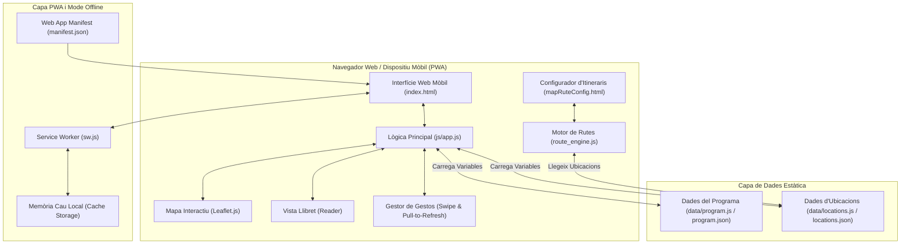

# 🎈 Festes de Santa Tecla Tarragona 2026 - Guia Interactiva i PWA

Aplicació web i **Progressive Web App (PWA)** oficial per a la consulta interactiva del programa, ubicacions, horaris, itineraris i llibret de les **Festes de Santa Tecla 2026 a Tarragona**.

---

## 💡 Model d'Arquitectura: PWA 100% Estàtica (Jamstack Client-Side)

L'aplicació és una **Progressive Web App (PWA) 100% Client-Side**. No necessita cap servidor backend ni procés actiu per a funcionar.

- **Execució en el Navegador**: Funciona directament en qualsevol dispositiu mòbil o d'escriptori executant **HTML5, CSS3, JavaScript (ES6+), JSON, Leaflet.js i Service Worker**.
- **Allotjament Estàtic**: Es pot publicar a qualsevol hosting estàtic (com GitHub Pages, Vercel o Netlify) o servir directament com a fitxers estàtics.
- **Funcionament 100% Offline**: Gràcies al Service Worker (`sw.js`), tota la informació dels actes, adreces, coordenades, mapa i llibret queda emmagatzemada en la memòria cau local del dispositiu per garantir la consulta sense connexió a Internet durant la Festa Major.

---

## 🛠️ 1. Taula de Llenguatges i Tecnologies Web

| Tecnologia / Llenguatge | Rol i Funció en l'Aplicació | Fitxers Principals |
| :--- | :--- | :--- |
| **HTML5** | Estructura semàntica de la guia, metadades PWA, enllaços de favicon i mòduls principals. | `index.html`, `mapRuteConfig.html` |
| **CSS3 (Vanilla)** | Estils visuals, disseny responsiu mòbil, variables de color, glassmorphism, animacions i gestió d'estats deshabilitats. | `css/styles.css` |
| **JavaScript (ES6+)** | Lògica del frontend, manipulació dinàmica del DOM, filtratge per dies/hores, gestió de gestos de lliscament (*swipe*) i registre de PWA. | `js/app.js`, `route_engine.js` |
| **JSON** | Emmagatzematge estructurat d'esdeveniments, coordenades, adreces, itineraris i metadades PWA. | `data/program.json`, `data/locations.json`, `manifest.json` |
| **Leaflet.js (v1.9.4)** | Llibreria per a la visualització de cartografia interactiva, marcadors d'actes amb hores i traçat de rutes en gradient sobre el mapa. | Carregada des de CDN (`leaflet.js` / `leaflet.css`) |
| **Service Worker (PWA)** | Cache *Stale-While-Revalidate* per permetre el funcionament de l'aplicació 100% Offline al mòbil. | `sw.js` |

---

## 🏗️ 2. Esquema de Funcionament del Sistema

El següent diagrama il·lustra l'arquitectura de l'aplicació client, el flux de dades i el suport offline:



---

L'aplicació organitza la informació en dos fitxers JSON principals relacionats entre ells mitjançant identificadors únics (`id` i `location_id`).

> [!IMPORTANT]
> **Font Única de la Veritat (Single Source of Truth)**:
> Els actes del programa (`data/program.json`) fan referència a la seva ubicació mitjançant el camp `"location_id": "anticajuntament"`. En temps d'execució, la funció `getEventLoc(ev)` a `js/app.js` resol dinàmicament el nom, les coordenades GPS i l'adreça des del diccionari master `data/locations.json`. D'aquesta manera, quan es modifica la posició o adreça d'un espai a `locations.json`, **tots els actes associats a aquesta ubicació s'actualitzen automàticament al mapa i a la interfície alhora, sense haver d'editar cada esdeveniment d'un en un**.

### A. Fitxer d'Ubicacions (`data/locations.json`)
Conté el diccionari master de tots els espais i recorreguts festius de la ciutat. Admet dos tipus d'ubicació:

#### 1. Ubicació Fixa (Punt Únic)
Per a actes que tenen lloc en un espai concret (plaça, teatre, escola, monument, etc.):

```json
"anticajuntament": {
  "id": "anticajuntament",
  "name": "Centre Cultural Antic Ajuntament",
  "address": "Carrer Major, 41, 43003 Tarragona",
  "lat": 41.11717,
  "lng": 1.25626,
  "keywords": [
    "antic ajuntament",
    "carrer major, 41",
    "c. major, 41"
  ]
}
```

#### 2. Ubicació amb Itinerari / Recorregut
Per a cercaviles, processons o correfocs. Conté el punt d'inici (`lat`, `lng`) així com la descripció del trajecte i les coordenades (`waypoints` i `coordinates`) per traçar el recorregut al mapa:

```json
"route_st26_cleaned_0054": {
  "id": "route_st26_cleaned_0054",
  "name": "Plaça de la Font (Itinerari Baixada d'Amparitos)",
  "address": "Plaça de la Font, Tarragona",
  "type": "route",
  "lat": 41.11727,
  "lng": 1.25577,
  "route_info": {
    "has_route": true,
    "description": "Itinerari: pl. Sedassos, c. Sant Domènec, pl. de la Font, c. Comte de Rius, Rambla Nova...",
    "waypoints": [
      { "lat": 41.11727, "lng": 1.25577, "name": "Punt 1" },
      { "lat": 41.11753, "lng": 1.25468, "name": "Punt 2" }
    ],
    "coordinates": [
      [41.11727, 1.25577],
      [41.11753, 1.25468]
    ]
  }
}
```

---

### B. Exemples d'Activitats (`data/program.json`)
Estructura unificada i 100% neta de cada esdeveniment festiu, enllaçant únicament la seva ubicació o ruta mitjançant `location_id`:

#### 1. Activitat amb Hora i Ubicació Estàndard
```json
{
  "id": "st26_cleaned_0054",
  "date": "2026-09-12",
  "time": "19:00",
  "hour": 19,
  "title": "Baixada d’Amparitos",
  "category": "Tradició i Cultura Popular",
  "location_id": "route_st26_cleaned_0054",
  "description": "Recorregut festiu amb les bandes de música...",
  "image": "img/image.jpeg",
  "url": "https://www.tarragona.cat/cultura/festes-i-cultura-popular/santa-tecla",
  "is_all_night": false
}
```

#### 2. Activitat amb Rang de Data, Rang d'Hora i Mode Nit (`is_all_night`)
Per a les revetlles que s'allarguen durant tota la nit d'un dia a l'altre (ex: Nit del 22 al 23 de setembre):

```json
{
  "id": "st26_cleaned_0448",
  "date": "2026-09-22 to 2026-09-23",
  "time": "23:00 to 7:00",
  "hour": 23,
  "title": "La revetlla més teclera",
  "category": "Música i Concerts",
  "location_id": "font",
  "description": "Les Caipirinyes i l'Orquestra Mitjanit ens portaran fins ben entrada la nit els èxits més trepidants...",
  "image": "img/image.jpeg",
  "url": "https://www.tarragona.cat/cultura/festes-i-cultura-popular/santa-tecla",
  "is_all_night": true
}
```

---

## 🔄 4. Mòduls Clau i Funcionament de la Interfície

### A. Selecció de Dia i Hora (`js/app.js`)
1. **Estat Global**: L'aplicació manté variables d'estat globals:
   - `currentDay`: Data activa (ex. `"2026-09-12"` fins a `"2026-09-24"` o la pestanya especial `"2026-09-22 to 2026-09-23"`).
   - `currentHour`: Hora seleccionada al slider (entre 8h i 26h).
   - `showAllDay`: Booleà per mostrar tots els actes d'un dia.

2. **Pestanya Especial Nit de les Revetlles ("Del 22 al 23 🌙")**:
   - Quan `currentDay === "2026-09-22 to 2026-09-23"`, s'executa la funció `isEventOnDay()`.
   - Selecciona **únicament** els actes de revetlla que duren tota la nit (`is_all_night: true`).
   - El slider d'hores i la casella "Tot el dia" queden deshabilitats visualment i lògicament (`disabled = true`).

3. **Renderització del Mapa i Llista (`renderSchedule()`)**:
   - `renderSchedule()` agrupa els actes filtrats per l'hora d'inici real.
   - Crea targetes d'actes amb imatge, categoria, adreça i botó d'itinerari.
   - Afegeix les marcadores personalitzades al mapa de Leaflet amb la icona de l'hora d'inici o de la lluna (`🌙`).

---

### B. Mode Offline i PWA (`sw.js` & `manifest.json`)
- **Instal·lació**: En carregar l'aplicació, `registerServiceWorker()` a [app.js](file:///home/andreu/Documents/Code/FestesSantaTecla2026/js/app.js#L1003) enregistra `sw.js`.
- **Estratègia de Cache**: Utilitza l'estratègia **Stale-While-Revalidate**. Si l'usuari es troba en una zona de molta gent sense cobertura mòbil durant la festa, l'aplicació s'obre immediatament des de la memòria cau local sense fallar.
- **PWA Standalone**: Gràcies a [manifest.json](file:///home/andreu/Documents/Code/FestesSantaTecla2026/manifest.json), l'aplicació es pot afegir a la pantalla d'inici d'Android i iOS com una aplicació nativa.

---

## 📂 5. Estructura del Repositori a GitHub

```text
FestesSantaTecla2026/          # Repositori Principal
├── index.html                 # Pàgina principal (Guia, Mapa + Llibret)
├── mapRuteConfig.html         # Configurador visual d'itineraris i rutes
├── manifest.json              # Configuració PWA (nom, colors, icones)
├── sw.js                      # Service Worker (Cache offline)
├── route_engine.js            # Motor de càlcul de rutes sobre OpenStreetMap
├── README.md                  # Portada i documentació principal a GitHub
├── .gitignore                 # Filtre de fitxers de desenvolupament
│
├── css/
│   └── styles.css             # Estils CSS3 de l'aplicació i estats PWA
│
├── js/
│   └── app.js                 # Lògica de control, mapa, swipe i renderitzat
│
├── data/
│   ├── locations.json         # Coordenades i adreces oficials d'ubicacions
│   ├── locations.js           # Adaptador de dades d'ubicació en variable JS
│   ├── program.json           # Llistat complet d'actes en format JSON
│   └── program.js             # Adaptador del programa en variable JS
│
└── img/
    ├── favicon.png            # Icona principal 192x192 px
    ├── icon-192.png           # Icona PWA 192x192 px
    ├── icon-512.png           # Icona PWA 512x512 px
    ├── icon-maskable-192.png  # Icona adaptativa PWA 192x192 px
    └── icon-maskable-512.png  # Icona adaptativa PWA 512x512 px
```

---

## 📌 Resum Arquitectònic

L'aplicació segueix una arquitectura **Jamstack / PWA 100% estàtica**:
1. **Zero dependències de servidor**: La guia web de Santa Tecla 2026 no requereix cap servidor backend actiu per a la consulta de la festa.
2. **Execució nativa al navegador**: Tot el filtratge per hores, dies, cerques i marcadors del mapa s'executa directament al dispositiu client amb JavaScript Vanilla.
3. **Mode Offline total**: Gràcies al Service Worker (`sw.js`), l'usuari pot obrir l'aplicació al seu telèfon mòbil i consultar tot el programa i el mapa **sense connexió a Internet** durant les Festes de Santa Tecla.
